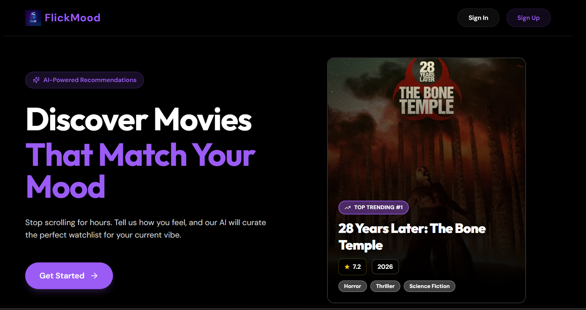
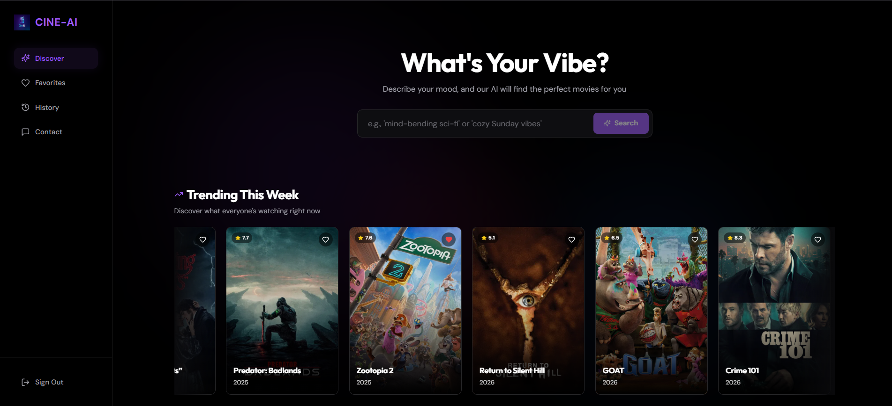
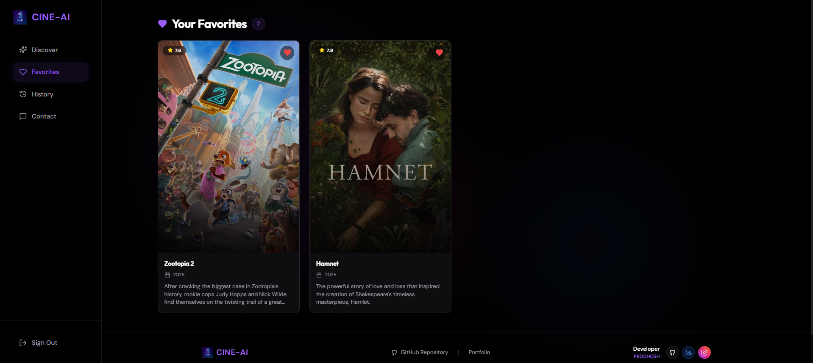
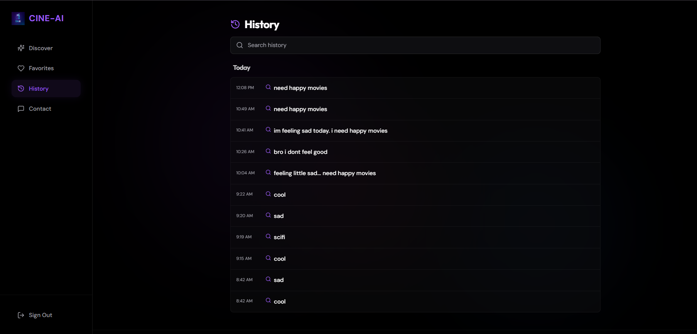

# 🎬 FLICK-MOOD

> **Your mood, our AI, perfect movies.**

An AI-powered movie recommender that understands your vibe. Tell us how you feel, and we'll find the perfect movies for you.


## 📸 Preview

### Landing Page


### AI-Powered Discover


### Your Favorites Collection


### Search History


## ✨ Features

- 🤖 **AI-Powered** - Gemini AI analyzes your mood
- 🎥 **15K+ Movies** - Powered by TMDB
- ⭐ **Save Favorites** - Build your collection
- 📜 **Search History** - Track your vibes
- 🔐 **Secure Auth** - Email or Google sign-in

## 🚀 Quick Setup

### 1. Clone & Install

```bash
git clone <your-repo-url>
cd ai-movie-recommender
npm install
```

### 2. Get Your API Keys

| Service | Get Key | Why? |
|---------|---------|------|
| [Supabase](https://supabase.com) | Free account → New project → Settings/API | Auth & Database |
| [TMDB](https://www.themoviedb.org/settings/api) | Free account → Settings/API → Request key | Movie data |
| [Gemini](https://makersuite.google.com/app/apikey) | Google account → Get API Key | AI recommendations |

### 3. Setup Environment

Create `client/.env`:
```env
VITE_SUPABASE_URL=https://your-project.supabase.co
VITE_SUPABASE_ANON_KEY=your-anon-key
VITE_TMDB_API_KEY=your-tmdb-key
```

Create `.env` (root):
```env
GEMINI_API_KEY=your-gemini-key
```

### 4. Setup Database

Run this SQL in Supabase SQL Editor:

```sql
-- Favorites table
CREATE TABLE favorites (
  id UUID PRIMARY KEY DEFAULT uuid_generate_v4(),
  user_id UUID REFERENCES auth.users NOT NULL,
  movie_id INTEGER NOT NULL,
  movie JSONB NOT NULL,
  created_at TIMESTAMPTZ DEFAULT NOW()
);

-- History table
CREATE TABLE mood_history (
  id UUID PRIMARY KEY DEFAULT uuid_generate_v4(),
  user_id UUID REFERENCES auth.users NOT NULL,
  mood TEXT NOT NULL,
  generated_genres JSONB,
  created_at TIMESTAMPTZ DEFAULT NOW()
);

-- Enable Row Level Security
ALTER TABLE favorites ENABLE ROW LEVEL SECURITY;
ALTER TABLE mood_history ENABLE ROW LEVEL SECURITY;

-- RLS Policies
CREATE POLICY "Users can manage their favorites"
  ON favorites FOR ALL USING (auth.uid() = user_id);

CREATE POLICY "Users can manage their history"
  ON mood_history FOR ALL USING (auth.uid() = user_id);
```

### 5. Run It! 🎉

```bash
npm run dev
```

Visit `http://localhost:5174` and start discovering movies! 🍿

## 📦 Deploy to Netlify

1. Push to GitHub
2. Connect repo to [Netlify](https://netlify.com)
3. Add environment variables (same as above)
4. Deploy! 🚀

## 🛠 Tech Stack

**Frontend:** React · TypeScript · Vite · TailwindCSS · Framer Motion  
**Backend:** Supabase · Netlify Functions  
**APIs:** TMDB · Google Gemini AI  
**State:** TanStack Query

---

Made with ❤️ for movie lovers
